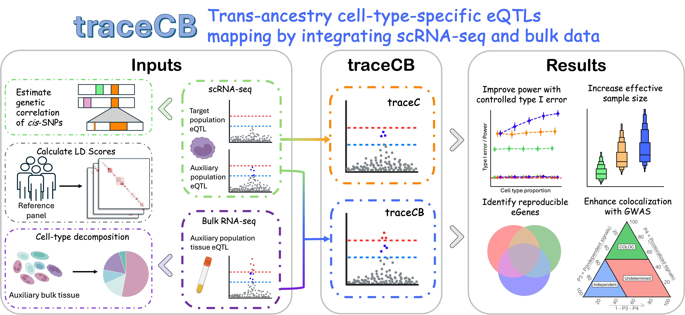

# traceCB: Trans-ancestry cell-type-specific eQTLs mapping by integrating scRNA-seq and bulk data

! Note: Xinyi Yu has no contribution to this project. Adding individuals who have made no contribution to the list of authors constitutes academic misconduct. I personally strongly condemn this practice.

[](https://www.python.org/downloads/)
[](https://opensource.org/licenses/GPL-3.0)

This repository contains code for the **traceCB** paper, featuring the main algorithm and a complete pipeline for trans-ancestry cell-type-specific eQTL mapping.



## Repository Structure

- `src/traceCB`: The main source code for the Python package.
- `src/coloc`: Scripts for colocalization analysis.
- `src/visual`: Visualization scripts for GMM results.
- `shell`: Shell scripts for running the pipeline steps (preprocessing, LDSC, GMM, etc.).
- `docs`: Documentation and tutorials.
- `data`: Folder for storing input/output data (see `docs/pipeline.md` for structure).

## Installation

### Prerequisites
- Python >= 3.8
- `numba`, `pyarrow`, `scipy`

### Install from source

Clone the repository and install the package using pip:

```bash
git clone https://github.com/lucajiang/traceCB.git
cd traceCB
```

**Activate your preferred Python environment** (recommended, required python 3.8 or above):
```bash
conda activate <your_env_name>
```

Or, create a new environment:
```bash
conda create -n traceCB_env python=3.8
conda activate traceCB_env
```

Then install the dependencies and this package:
```bash
pip install -e .
```

Installation in editable mode (`-e`) allows you to import the `traceCB` module in your scripts while keeping the ability to modify the source code if needed.

## Tutorial

A step-by-step tutorial notebook is provided at `docs/tutorial/run_traceCB.ipynb`. This tutorial guides you through running the traceCB algorithm on a single gene example.

It is highly recommended to run this tutorial first to understand the input data format and model outputs.

## Usage Pipeline

For full-scale analysis, we provide a structured shell-script pipeline. Detailed preprocessing steps are described in [Pipeline Documentation](https://lucajiang.github.io/traceCB/pipeline/).

### 1. Configuration

1. Install [s-ldxr](https://github.com/huwenboshi/s-ldxr) and [plink1.9](https://www.cog-genomics.org/plink/).
2. Prepare python environment for `s-ldxr` which requires `pysnptools` and `statsmodels` addtionally.
    ```bash
    pip install pysnptools
    pip install statsmodels
    ```
    Prepare R environment if you need to run COLOC. Otherwise, omit the r_env option in next step.
3. Modify `shell/setting.sh` to specify your paths and parameters according to your environment.

### 2. Run Pipeline Steps
The analysis is divided into sequential modules:

```bash
# 1. Merge and align GWAS summary statistics
source shell/run_merge.sh

# 2. Calculate LD scores (s-ldxr)
source shell/run_ld.sh

# 3. Run Generalized Method of Moments (GMM)
source shell/run_gmm.sh

# 4. Colocalization Analysis (Optional)
source shell/run_coloc.sh
```

### 3. Visualization
Scripts for visualization are provided in `src/visual/`.

## Citation

If you use **traceCB** in your research, please cite our paper:

> *Citation pending...*

## License

This project is licensed under the GPL-3 License - see the LICENSE file for details.

## Contact

For any questions or issues, please contact [wx.jiang@my.cityu.edu.hk](mailto:wx.jiang@my.cityu.edu.hk) or open an issue on GitHub.
