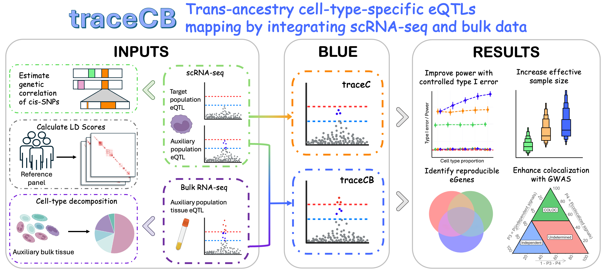

# Welcome to traceCB

**traceCB** is a Python package for **Tra**ns-ancestry **c**ell-type-specific **e**QTL effects mapping by integrating s**C**RNA-seq and **B**ulk data.

[](img/traceCB.png)

!!! info "Key Capabilities"
    traceCB enables researchers to:
    
    * **Integrate** single-cell RNA-seq data with bulk GWAS summary statistics.
    * **Estimate** cell-type-specific eQTL effects across different populations.
    * **Perform** trans-ancestry analysis to improve resolution and power.

---

## Features

<div class="grid cards" markdown>

-   :material-dna: **Integration**
    ---
    Seamlessly combines single-cell precision with bulk data scale for enhanced biological insights.

-   :material-earth: **Trans-ancestry**
    ---
    Leverages genetic diversity across populations to identify robust and causal signals.

-   :material-speedometer: **Efficiency**
    ---
    optimized numeric computing kernel using `numba` ensures high-performance analysis on large datasets.

</div>

## Getting Started

### Installation

Prerequisites: Python >= 3.8

```bash
git clone https://github.com/lucajiang/traceCB.git
cd traceCB
pip install -e .
```

### Documentation

Explore our documentation to learn how to use traceCB:

* [Pipeline Workflow](pipeline.md) - Detailed steps for data preprocessing.
* [API Reference](api_reference.md) - Documentation for core functions.
* [Tutorial](https://github.com/LucaJiang/traceCB/blob/master/docs/tutorial/run_traceCB.ipynb) - Jupyter notebook example.

## Citation

If you use **traceCB** in your research, please cite our paper:

> *Citation pending...*

## Support

For any questions or issues, please contact [wx.jiang@my.cityu.edu.hk](mailto:wx.jiang@my.cityu.edu.hk) or open an issue on GitHub.

<!-- cmd to preview: mkdocs serve -->