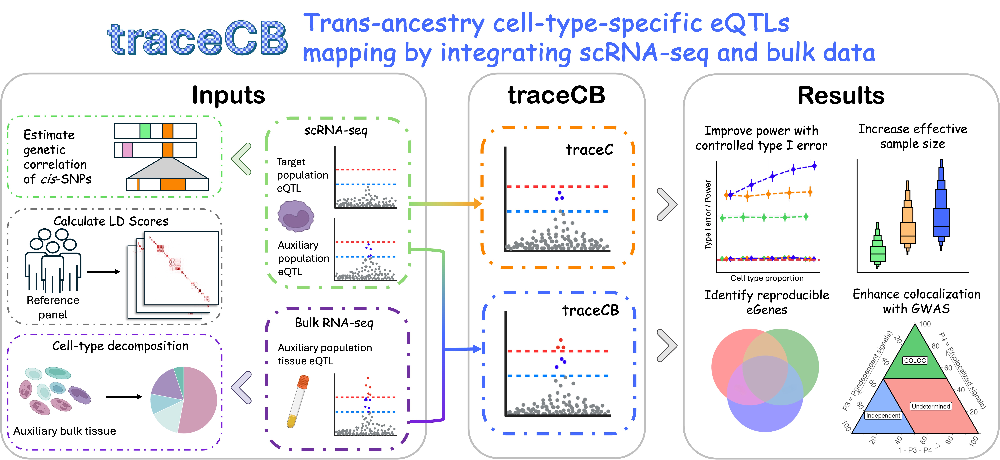

# traceCB

**traceCB** maps trans-ancestry cell-type-specific eQTL effects by integrating
single-cell and bulk-tissue summary statistics. This documentation covers the
installable Python package, full-data workflow, tutorial, simulations, and
manuscript analyses distributed with the repository.

[](img/traceCB.jpg)

!!! info "Key Capabilities"
    traceCB enables researchers to:
    
    * **Integrate** single-cell and bulk eQTL data for trans-ancestry ct-eQTL mapping
    * **Estimate** effects efficiently with a generalized method-of-moments model
    * **Increase** discovery power while maintaining type I error control

---

## Features

<div class="grid cards" markdown>

-   :material-dna: **Integration**
    ---
    Seamlessly combines single-cell precision with bulk data scale for enhanced biological insights.

-   :material-earth: **Trans-ancestry**
    ---
    Leverages genetic diversity across populations to identify robust and causal signals.

-   :material-speedometer: **Efficiency**
    ---
    Optimized numerical kernels using `numba` support large datasets.

</div>

## Getting Started

### Installation

Python 3.10 or newer is required. The repository is developed and tested with
the Python 3.12 reference environment in `environment.yml`.

```bash
git clone https://github.com/lucajiang/traceCB.git
cd traceCB
conda env create -f environment.yml
conda activate py312
```

For a library-only installation, use `pip install -e .` in an existing
supported Python environment.

In a lightweight or custom environment, install `.[tutorial]` to run the local
notebook, or `.[enrichment,figures]` for the manuscript analysis scripts.

### Repository organization

* `src/traceCB/`: installable model implementation.
* `scripts/`: preprocessing, LD-score, GMM, and colocalization entry points.
* `src/preprocess/` and `src/coloc/`: workflow implementations.
* `src/simulation/`: main, supplementary, and chromosome 22 simulations.
* `src/enrichment/`: S-LDSC and pathway-enrichment analyses.
* `src/figures/`: manuscript figure scripts.
* `tests/`: unit and command-line contract tests.

### Guides

Explore our documentation to learn how to use traceCB:

* [Pipeline workflow](pipeline.md) — input sources, formats, preprocessing, and full-data execution.
* [API reference](api_reference.md) — core model functions.
* [Tutorial](tutorial.md) — local and Google Colab walkthroughs.
* [Simulation guide](https://github.com/lucajiang/traceCB/blob/master/src/simulation/README.md) — manuscript simulation entry points.
* [Enrichment guide](https://github.com/lucajiang/traceCB/blob/master/src/enrichment/README.md) — S-LDSC and pathway analyses.

## Citation

If you use **traceCB** in your research, please cite the accompanying paper.
Citation details will be added when the paper record is available.

## Support

For any questions or issues, please contact [wx.jiang@my.cityu.edu.hk](mailto:wx.jiang@my.cityu.edu.hk) or open an issue on GitHub.

<!-- cmd to preview: mkdocs serve -->
