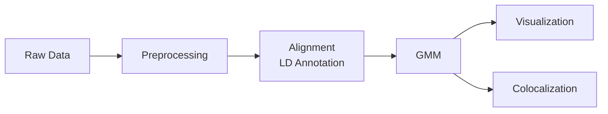

# HowTO: Run traceCB pipeline

This guide details the steps to preprocess data, execute the traceCB GMM model, and visualize the results.

All logs will be saved to your specified `log_path`. Please review the log files carefully for any warnings or errors.

!!! warning Data Format Requirement
    If you use your own eQTL data, ensure the input data format matches the specifications described below exactly to avoid runtime errors.

## Workflow Overview



## Preprocessing

Data sources and software used in our study (and supported by default):

Data Sources:

*   **eQTLCatalogue**: [Tabix Index](https://github.com/eQTL-Catalogue/eQTL-Catalogue-resources/blob/master/tabix/tabix_ftp_paths.tsv)
*   **GTEx**: [Google Cloud](https://console.cloud.google.com/storage/browser/gtex-resources/GTEx_Analysis_v8_QTLs/GTEx_Analysis_v8_EUR_eQTL_all_associations;tab=objects?inv=1&invt=Ab037A&prefix=&forceOnObjectsSortingFiltering=true) or [Portal](https://www.gtexportal.org/home/downloads/adult-gtex/qtl)
*   **eQTLGen**: [Official Site](https://www.eqtlgen.org/phase1.html)
*   **BBJ**: [Official Site](http://jenger.riken.jp/en/result)
*   **1000G**: [Plink2 Resource](https://www.cog-genomics.org/plink/1.9/resources#phase1)
*   **PopCell (AFR)**: [Nature 2023](https://doi.org/10.1038/s41586-023-06422-9). *Restricted Access* - [Apply Here](https://dataset.owey.io/doi/10.48802/owey.e4qn-9190).

Software:

*   **S-LDXR**: [GitHub Algo](https://github.com/huwenboshi/s-ldxr/tree/master)
*   **Plink1.9**: [Official Site](https://www.cog-genomics.org/plink/1.9/)
*   **Cibersortx**: [Official Site](https://cibersortx.stanford.edu/) used for cell type proportion estimation from GTEx data.
*   **COLOC**: [CRAN Package](https://cran.r-project.org/web/packages/coloc/index.html) used for colocalization analysis (optional).

### Format Data by Chromosome

To optimize Python loading times, we split and format the data by chromosome.

=== "GTEx"

    To process **GTEx Whole Blood** data:
    
    `shell/GTEx_Preprocess.sh`

    **Input Format** (`GTEx_Analysis_v8_QTLs-GTEx_Analysis_v8_eQTL_all_associations-Whole_Blood.allpairs.txt.gz`)
    
    | gene_id           | variant_id         | tss_distance | ma_samples | ma_count | maf   | pval_nominal | ... |
    | ----------------- | ------------------ | ------------ | ---------- | -------- | ----- | ------------ | --- |
    | ENSG00000227232.5 | chr1_13550_G_A_b38 | -16003       | 19         | 19       | 0.014 | 0.734        | ... |

    **Output Format** (`chr22.csv`)
    
    | GENE            | RSID        | CHR | POS      | TSS_DISTANCE | A1  | A2  | MAF    | PVAL  | BETA  | SE    |
    | --------------- | ----------- | --- | -------- | ------------ | --- | --- | ------ | ----- | ----- | ----- |
    | ENSG00000008735 | rs117049661 | 22  | 49600902 | -999783      | T   | C   | 0.0067 | 0.613 | 0.133 | 0.263 |

=== "BBJ"

    To process **BBJ cell type** data:
    
    `shell/BBJ_Preprocess.sh`
    
    **Input Format** (`chr22_cis_eqtl_mapping_nofilt_nomulti_with_alleles.txt.gz`)

    | SNP              | POS      | REF | ALT | gene               | beta  | t-stat | p-value |
    | ---------------- | -------- | --- | --- | ------------------ | ----- | ------ | ------- |
    | chr22:16201313:I | 16201313 | A   | AG  | ENSG00000100181.17 | 0.114 | 0.355  | 0.722   |

    **Output Format** (`chr22.csv`)

    | CHR | RSID      | POS      | A2  | A1  | GENE            | BETA   | Z      | PVAL  |
    | --- | --------- | -------- | --- | --- | --------------- | ------ | ------ | ----- |
    | 22  | rs1000427 | 36890105 | G   | A   | ENSG00000100055 | -0.152 | -0.858 | 0.392 |

=== "eQTLCatalogue"

    To process **eQTLCatalogue** data:
    
    `shell/eQTLCatalogue_Preprocess.sh`

    **Input Format** (`QTD000031.all.tsv.gz`)

    | molecular_trait_id | chromosome | position | ref | alt | variant        | ... | beta  | se  |
    | ------------------ | ---------- | -------- | --- | --- | -------------- | --- | ----- | --- |
    | ENSG00000187583    | 1          | 14464    | A   | T   | chr1_14464_A_T | ... | 0.185 | NP  |

    **Output Format** (`chr22.csv`)

    | CHR | RSID      | GENE            | POS      | A1  | A2  | BETA   | SE    | PVAL  | Z      | N   |
    | --- | --------- | --------------- | -------- | --- | --- | ------ | ----- | ----- | ------ | --- |
    | 22  | rs5747203 | ENSG00000015475 | 17493644 | A   | G   | -0.040 | 0.148 | 0.786 | -0.270 | 167 |

=== "PopCell (AFR)"

    To process **African Population** data from *Aquino et al. (2023)*:

    **Source**: *Dissecting human population variation in single-cell responses to SARS-CoV-2*, **Nature** (2023).

    !!! warning "Data Access Control"
        This dataset requires specific application for access. 
        Please visit the **[Owey Dataset Portal](https://dataset.owey.io/doi/10.48802/owey.e4qn-9190)** for application details.

    **Preprocessing Pipeline**:
        
    Please refer to the external repository **[popCell_SARS-CoV-2](https://github.com/h-e-g/popCell_SARS-CoV-2)** for upstream processing scripts. 
    Ensure the final output is formatted to match the `traceCB` standard (see other tabs).

### Cell Type Information & Proportion

#### eQTLCatalogue ID and Cell Types

    
| ID          | Dataset (N)          | Cell Type    |
| :---------- | :------------------- | :----------- |
| `QTD000021` | BLUEPRINT (191)      | Monocytes    |
| `QTD000069` | CEDAR (286)          | Monocytes    |
| `QTD000081` | Fairfax_2014 (420)   | Monocytes    |
| `QTD000031` | BLUEPRINT (167)      | CD4+ T cells |
| `QTD000067` | CEDAR (290)          | CD4+ T cells |
| `QTD000371` | Kasela_2017 (280)    | CD4+ T cells |
| `QTD000066` | CEDAR (277)          | CD8+ T cells |
| `QTD000372` | Kasela_2017 (269)    | CD8+ T cells |
| `QTD000073` | CEDAR (262)          | B cells      |
| `QTD000115` | Gilchrist_2021 (247) | NK cells     |

#### Proportion Calculation

You can use any method to obtain cell type proportions. We recommend using GTEx whole blood TPM files with **Cibersortx**.

**Example Output (`cell_type_proportion.csv`)**:
```csv
Cell_type,Proportion
B_cells,0.8069001744805046
PCs,0.30700693083630154
CD4+T_cells,10.401165801186464
...
```

### Alignment

Run `src/preprocess/MergeChr.py` via `shell/run_merge.sh` to align all input data files. 

*   Results will be saved to `save_path_main`.
*   The cell type proportion file will strictly accompany the aligned data.

**Directory Structure**:
```
<save_path_main>/EAS_GTEx/QTD000021/
├── AUX_Monocytes/
├── INFO/
├── TAR_Monocytes/
└── Tissue/
```

### Annotation & LD Scores

#### 1. Annotate LD
Run `src/preprocess/create_ld_annot.py` via `shell/run_ld.sh`. This step prepares 1000G data for `s-ldxr`.

!!! note Dependency
    Requires `pysnptools` and `statsmodels` to run s-ldxr. Ensure these are installed in your Python environment.

    

**Input**: `1000G.<pop>.QC.maf.@.bed/bim/fam`

**Output**:
```text
<save_path_main>/EAS_GTEx/QTD000021/LDSC/LD_annotation:
1.print_snps.txt
1.annot.gz
...
```

#### 2. Run s-ldxr
Use `shell/run_ld.sh` to calculate gene-level LD scores.

!!! failure Common Error
    ```text
    IndexError: index 16464 is out of bounds for axis 0 with size 16464
    ```
    This usually indicates an alignment mismatch. **Check if all input files are correctly aligned.**

## GMM Modeling

After preprocessing, your study folder should follow this structure:

```tree
.
├── AUX_Monocytes
├── celltype_proportion.csv
├── gene_snp_count
├── INFO
├── LDSC
├── TAR_Monocytes
└── Tissue
```

Execute `shell/run_gmm.sh` (wraps `src/traceCB/run_gmm.py`) to run the GMM model.

### Output Files

The results are saved in Parquet notation for performance.

**1. Gene-level Results** (`ENSG@.parquet`)

Contains detailed effect size estimates for Target (TAR), Auxiliary (AUX), and Tissue populations under different models (S: Summary, C: Cross-pop, T: Tissue-enhanced).

| RSID       | TAR_SBETA | TAR_CBETA | TAR_TBETA | TAR_SPVAL | ... |
| ---------- | --------- | --------- | --------- | --------- | --- |
| rs10985869 | -0.513    | -0.515    | -0.637    | 0.0009    | ... |

**2. Chromosome Summary** (`summary.csv`)

Contains heritability estimates ($h^2$) and effective sample sizes ($N_{eff}$).

| GENE      | NSNP | H1SQ     | H2SQ     | TAR_SNEFF | ... |
| --------- | ---- | -------- | -------- | --------- | --- |
| ENSG...63 | 2321 | 7.49e-05 | 2.53e-04 | 269.05    | ... |

!!! note Performance Optimization
    We use `numba` with `jit` and `nogil` for high-performance computing. If you need to debug, you can comment out the `@` decorators in the source code, though this will significantly slow down execution.

## Colocalization

### Prerequisites

*   [LDlinkR API Token](https://cran.r-project.org/web/packages/LDlinkR/vignettes/LDlinkR.html) (Required for `src/coloc/run_ldlink.R`)
*   **Bedtools**: `closestBed` binary
*   **References**: hg19/GRCh37 cytoband, Gene Annotation BED

### 1. Leading SNP Annotation
Run `src/coloc/find_leadingSNP.py`:

```bash
python src/coloc/find_leadingSNP.py \
  --gwas_sumstats_path <PATH> \
  --save_path <OUTPUT> \
  --save_prefix <PREFIX>
```

**Key Outputs:**
*   `{prefix}_loci.csv`: Final result merging SNP positions with closest Ensembl gene IDs.

### 2. Run COLOC
Use `shell/run_coloc.sh` to execute the colocalization analysis for each study.

## Visualization

Visualization scripts are located in `src/visual/`.

*   **Logic**: `src/visual/utils.py` selects which study to plot.
*   **Style**: `src/visual/meta_data.json` defines colors, labels, and plot settings.

To reproduce Figure 3 or Figure 5 from our paper, ensure the correct study is selected in `utils.py`.
