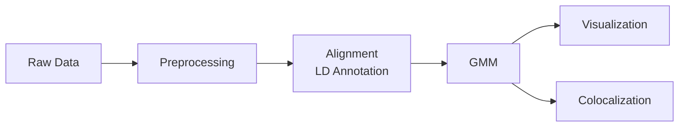

# Full-data pipeline

This guide describes how to obtain and format the external inputs, run the
traceCB GMM model, and generate downstream colocalization and figures. Run all
commands from the repository root.

First follow the [path configuration guide](configuration.md). It explains
which settings to change, the expected directory layouts, and how to ensure
figures read the results from your new run.

Workflow logs are written to `results/logs` by default. Set `TRACECB_LOG_DIR`
to choose another directory, and inspect the logs if a stage fails.

!!! warning Data Format Requirement
    If you use your own eQTL data, ensure the input data format matches the specifications described below exactly to avoid runtime errors.

## Workflow Overview


```mermaid
graph LR
    A[Raw Data] --> B[Preprocessing];
    B --> C[Alignment <br> LD Annotation];
    C --> D[GMM];
    D --> E[Visualization];
    D --> F[Colocalization];
```

## Preprocessing

Data sources and software used in our study (and supported by default):

Data Sources:

*   **eQTLCatalogue**: [Tabix Index](https://github.com/eQTL-Catalogue/eQTL-Catalogue-resources/blob/master/tabix/tabix_ftp_paths.tsv)
*   **GTEx**: [Google Cloud](https://console.cloud.google.com/storage/browser/gtex-resources/GTEx_Analysis_v8_QTLs/GTEx_Analysis_v8_EUR_eQTL_all_associations;tab=objects?inv=1&invt=Ab037A&prefix=&forceOnObjectsSortingFiltering=true) or [Portal](https://www.gtexportal.org/home/downloads/adult-gtex/qtl)
*   **eQTLGen**: [Official Site](https://www.eqtlgen.org/phase1.html)
*   **BBJ cell-type eQTLs**: [Human Database of Japan: hum0099-v1](https://humandbs.dbcls.jp/en/hum0099-v1)
*   **1000G**: [Plink Resource](https://www.cog-genomics.org/plink/1.9/resources#phase1) or [S-LDSC reference files](https://zenodo.org/records/10515792)
*   **PopCell (AFR)**: [Nature 2023](https://doi.org/10.1038/s41586-023-06422-9). *Restricted Access* - [Apply Here](https://dataset.owey.io/doi/10.48802/owey.e4qn-9190).

Software:

*   **S-LDXR**: [GitHub Algo](https://github.com/huwenboshi/s-ldxr/tree/master)
*   **Plink1.9**: [Official Site](https://www.cog-genomics.org/plink/1.9/)
*   **Cibersortx**: [Official Site](https://cibersortx.stanford.edu/) used for cell type proportion estimation from GTEx data.
*   **COLOC**: [CRAN Package](https://cran.r-project.org/web/packages/coloc/index.html) used for colocalization analysis (optional). The R workflow requires `arrow`, `coloc`, `data.table`, `dplyr`, `LDlinkR`, `readr`, and `stringr`.

### Format Data by Chromosome

To optimize Python loading times, we split and format the data by chromosome.

=== "GTEx"

    To process **GTEx Whole Blood** data:
    
    `scripts/preprocess_gtex.sh`

    **Input Format** (`GTEx_Analysis_v8_QTLs-GTEx_Analysis_v8_eQTL_all_associations-Whole_Blood.allpairs.txt.gz`)
    
    | gene_id           | variant_id         | tss_distance | ma_samples | ma_count | maf   | pval_nominal | ... |
    | ----------------- | ------------------ | ------------ | ---------- | -------- | ----- | ------------ | --- |
    | ENSG00000227232.5 | chr1_13550_G_A_b38 | -16003       | 19         | 19       | 0.014 | 0.734        | ... |

    **Output Format** (`chr22.csv`)
    
    | GENE            | RSID        | CHR | POS      | TSS_DISTANCE | A1  | A2  | MAF    | PVAL  | BETA  | SE    |
    | --------------- | ----------- | --- | -------- | ------------ | --- | --- | ------ | ----- | ----- | ----- |
    | ENSG00000008735 | rs117049661 | 22  | 49600902 | -999783      | T   | C   | 0.0067 | 0.613 | 0.133 | 0.263 |

=== "BBJ"

    To process **BBJ cell type** data:
    
    ```bash
    bash scripts/preprocess_bbj.sh <cell-type>
    ```
    
    **Input Format** (`chr22_cis_eqtl_mapping_nofilt_nomulti_with_alleles.txt.gz`)

    | SNP              | POS      | REF | ALT | gene               | beta  | t-stat | p-value |
    | ---------------- | -------- | --- | --- | ------------------ | ----- | ------ | ------- |
    | chr22:16201313:I | 16201313 | A   | AG  | ENSG00000100181.17 | 0.114 | 0.355  | 0.722   |

    **Output Format** (`chr22.csv`)

    | CHR | RSID      | POS      | A2  | A1  | GENE            | BETA   | Z      | PVAL  |
    | --- | --------- | -------- | --- | --- | --------------- | ------ | ------ | ----- |
    | 22  | rs1000427 | 36890105 | G   | A   | ENSG00000100055 | -0.152 | -0.858 | 0.392 |

=== "eQTLCatalogue"

    To process **eQTLCatalogue** data:
    
    `scripts/preprocess_eqtl_catalogue.sh`

    **Input Format** (`QTD000031.all.tsv.gz`)

    | molecular_trait_id | chromosome | position | ref | alt | variant        | ... | beta  | se  |
    | ------------------ | ---------- | -------- | --- | --- | -------------- | --- | ----- | --- |
    | ENSG00000187583    | 1          | 14464    | A   | T   | chr1_14464_A_T | ... | 0.185 | NP  |

    **Output Format** (`chr22.csv`)

    | CHR | RSID      | GENE            | POS      | A1  | A2  | BETA   | SE    | PVAL  | Z      | N   |
    | --- | --------- | --------------- | -------- | --- | --- | ------ | ----- | ----- | ------ | --- |
    | 22  | rs5747203 | ENSG00000015475 | 17493644 | A   | G   | -0.040 | 0.148 | 0.786 | -0.270 | 167 |

=== "PopCell (AFR)"

    To process **African Population** data from *Aquino et al. (2023)*:

    **Source**: *Dissecting human population variation in single-cell responses to SARS-CoV-2*, **Nature** (2023).

    !!! warning "Data Access Control"
        This dataset requires specific application for access. 
        Please visit the **[Owey Dataset Portal](https://dataset.owey.io/doi/10.48802/owey.e4qn-9190)** for application details.

    **Preprocessing Pipeline**:
        
    Please refer to the external repository **[popCell_SARS-CoV-2](https://github.com/h-e-g/popCell_SARS-CoV-2)** for upstream processing scripts. 
    Ensure the final output is formatted to match the `traceCB` standard (see other tabs).

### Prepare 1000G Reference Data

#### Option 1: Use S-LDSC Reference Files (Recommended)

Preprocessed 1000G reference files for `EUR` and `EAS` populations are available
from the [S-LDSC reference files](https://zenodo.org/records/10515792):
`1000G_Phase3_plinkfiles.tgz` for EUR and `1000G_Phase3_EAS_plinkfiles.tgz` for EAS.
Before using them, check the build, QC and file layout against the
[reference requirements](configuration.md#harmonization-ld-scores-and-gmm).
The current loaders require `1000G.*.QC.maf.<chr>.bed/bim/fam` directly inside
each population directory; the downloaded names are not necessarily compatible.
Renaming files alone does not establish matching QC or genome coordinates.

#### Option 2: Prepare a GRCh38 PLINK 2 panel

`scripts/preprocess_1000g.sh` expects a GRCh38 PLINK 2 panel with
`all_hg38.pgen`, `all_hg38.pvar`, and `all_hg38.psam` in `REFERENCE_DIR`.
It can decompress `all_hg38.pgen.zst` and `all_hg38_rs.pvar.zst`, and rename
`hg38_corrected.psam`. The sample file must contain superpopulation labels
in its fifth column. This path requires both PLINK 2 (`PLINK2`) and PLINK 1.9
(`PLINK1`); it does not ingest the pre-split BED archives from Option 1.

```bash
REFERENCE_DIR=/path/to/GRCh38_panel \
PLINK1=/path/to/plink PLINK2=/path/to/plink2 \
bash scripts/preprocess_1000g.sh
```

The script writes `1000G.<population>.QC.maf.<chromosome>.bed/bim/fam`
under `1000G_EAS`, `1000G_EUR`, and `1000G_AFR`. Set `LD_REFERENCE_DIR` to their
parent directory; the configuration derives `TARGET_LD_DIR` from the selected
population. Set `AUX_LD_DIR` if the EUR panel is stored elsewhere. Exporting
`TARGET_LD_DIR` alone does not override the current configuration.

### Genome builds and input selection

Choose reference panels and annotation coordinates consistently. The GTEx
preprocessing helper retains GRCh38 positions from the GTEx variant lookup;
`harmonize_inputs.py` matches SNPs by rsID and writes the tissue input's `POS`
column into `INFO/chr*.csv`. It does not perform liftover. Before using these
positions with colocalization or interval enrichment, convert them to the
build required by those analyses. The documented colocalization references
and the manuscript EUR S-LDSC annotation workflow use GRCh37/hg19.

The current harmonization loader identifies input formats from directory
names: use a target path containing `bbj` or `af`, and a tissue path containing
`gtex` or `eqtlgen` (case-insensitive). Set these paths through `scripts/config.sh`
or its environment-variable overrides before launching the workflow.

### Cell Type Information & Proportion

#### eQTLCatalogue ID and Cell Types

    
| ID          | Dataset (N)          | Cell Type    |
| :---------- | :------------------- | :----------- |
| `QTD000021` | BLUEPRINT (191)      | Monocytes    |
| `QTD000069` | CEDAR (286)          | Monocytes    |
| `QTD000081` | Fairfax_2014 (420)   | Monocytes    |
| `QTD000031` | BLUEPRINT (167)      | CD4+ T cells |
| `QTD000067` | CEDAR (290)          | CD4+ T cells |
| `QTD000371` | Kasela_2017 (280)    | CD4+ T cells |
| `QTD000066` | CEDAR (277)          | CD8+ T cells |
| `QTD000372` | Kasela_2017 (269)    | CD8+ T cells |
| `QTD000073` | CEDAR (262)          | B cells      |
| `QTD000115` | Gilchrist_2021 (247) | NK cells     |

#### Proportion Calculation

You can use any method to obtain cell type proportions. We recommend using GTEx whole blood TPM files with **Cibersortx**.

**Example Output (`cell_type_proportion.csv`)**:
```csv
Cell_type,Proportion
B_cells,0.8069001744805046
PCs,0.30700693083630154
CD4+T_cells,10.401165801186464
...
```

### Alignment

Run `src/preprocess/harmonize_inputs.py` via `scripts/prepare_inputs.sh` to align all input data files.

*   Results are saved to `results/<population>_<tissue-source>` by default.
*   The cell type proportion file will strictly accompany the aligned data.

**Directory Structure**:
```
results/EAS_GTEx/QTD000021/
├── AUX_Monocytes/
├── INFO/
├── TAR_Monocytes/
└── Tissue/
```

### Annotation & LD Scores

#### 1. Annotate LD
Run `src/preprocess/build_ld_annotations.py` via `scripts/run_ld_scores.sh`. This step prepares 1000G data for `s-ldxr`.

!!! note Dependency
    Requires `pysnptools` and `statsmodels` to run s-ldxr. Ensure these are installed in your Python environment.

    

**Input**: `1000G.<pop>.QC.maf.@.bed/bim/fam`

**Output**:
```text
results/EAS_GTEx/QTD000021/LDSC/LD_annotation:
1.print_snps.txt
1.annot.gz
...
```

#### 2. Run s-ldxr
Use `scripts/run_ld_scores.sh` to calculate gene-level LD scores.

!!! failure Common Error
    ```text
    IndexError: index 16464 is out of bounds for axis 0 with size 16464
    ```
    This usually indicates an alignment mismatch. **Check if all input files are correctly aligned.**

## GMM Modeling

After preprocessing, your study folder should follow this structure:

```tree
.
├── AUX_Monocytes
├── celltype_proportion.csv
├── gene_snp_count
├── INFO
├── LDSC
├── TAR_Monocytes
└── Tissue
```

Execute `scripts/run_gmm.sh` (wraps `src/traceCB/run_gmm.py`) to run the GMM model.

### Output Files

The per-gene results are saved in Parquet format.

**1. Gene-level Results** (`ENSG@.parquet`)

Contains detailed effect size estimates for Target (TAR), Auxiliary (AUX), and Tissue populations under different models (S: Summary, C: Cross-pop, T: Tissue-enhanced).

| RSID       | TAR_SBETA | TAR_CBETA | TAR_TBETA | TAR_SPVAL | ... |
| ---------- | --------- | --------- | --------- | --------- | --- |
| rs10985869 | -0.513    | -0.515    | -0.637    | 0.0009    | ... |

**2. Chromosome Summary** (`summary.csv`)

Contains per-SNP genetic variance estimates (`H1SQ`, `H2SQ`), their standard
errors, and effective sample sizes (`N_eff`). The variance estimates are the
LDSC coefficients; they are not summed over all SNPs in a gene.

| GENE      | NSNP | H1SQ     | H2SQ     | TAR_SNEFF | ... |
| --------- | ---- | -------- | -------- | --------- | --- |
| ENSG...63 | 2321 | 7.49e-05 | 2.53e-04 | 269.05    | ... |

!!! note Performance Optimization
    We use `numba` with `jit` and `nogil` for high-performance computing. If you need to debug, you can comment out the `@` decorators in the source code, though this will significantly slow down execution.

## Colocalization

### Prerequisites

*   [LDlinkR API Token](https://cran.r-project.org/web/packages/LDlinkR/vignettes/LDlinkR.html), provided as `LDLINK_TOKEN`
*   **Bedtools**: `closestBed` binary
*   **References**: hg19/GRCh37 cytoband, Gene Annotation BED

### 1. Lead-variant annotation
Run `src/coloc/prepare_loci.py`:

```bash
LDLINK_TOKEN="your-token" python src/coloc/prepare_loci.py \
  --gwas <GWAS_SUMSTATS> \
  --gwas-format standard \
  --cytobands <CYTOBAND_TSV> \
  --genes <GENE_BED> \
  --output-dir <OUTPUT_DIR> \
  --output-prefix <PREFIX>
```

**Key Outputs:**
*   `{prefix}_loci.csv`: Final result merging SNP positions with closest Ensembl gene IDs.

### 2. Run COLOC
Use `scripts/run_colocalization.sh` to execute the colocalization analysis for each study.

## Visualization

Visualization scripts are located in `src/figures/`.

Install their Python dependencies with `pip install -e '.[figures]'` and see
`src/figures/README.md` for R dependencies and invocation examples.

*   **Inputs and outputs**: `scripts/config.sh` configures all Python and R figure paths.
*   **Style**: `src/figures/metadata.json` defines colors, labels, and plot settings.

Before running, edit `TRACECB_STUDY_DIR`, `TRACECB_GTEX_GENE_ANNOTATION`, and
`TRACECB_FIGURE_DIR` in `scripts/config.sh` for your filesystem. The input defaults
refer to the current machine and must be replaced on other systems. The study
directory must contain `QTD*/GMM/chr*/summary.csv`; the annotation path must point
to the uncompressed GENCODE GTF file.

```bash
source scripts/config.sh
python -m figures.case_study
```

`source scripts/config.sh` exports the shared paths and population, sets
`PYTHONPATH` and the default headless Matplotlib backend, and creates the figure
output directory. Run it once per terminal session before invoking Python
figure modules in that shell. The case study uses the active Python environment
and writes results to `${TRACECB_FIGURE_DIR}/single_study/`. Figure output defaults
to `${TRACECB_OUTPUT_ROOT}/figures/${TARGET_POPULATION}_${TISSUE_SOURCE}`. For
EAS + eQTLGen, single-study figures therefore go to
`results/figures/EAS_eQTLGen/single_study/`; `python -m figures.combine_case_study`
writes the combined figures to `results/figures/EAS_eQTLGen/single_study_combined/`.

See the complete path table in `src/figures/README.md` for OASIS, OneK1K, CIMA,
GTEx, AFR, colocalization, and locus inputs. Existing manuscript studies default
to `${TRACECB_DATA_ROOT}/traceCB`; set `TRACECB_STUDY_ROOT` to
`${TRACECB_OUTPUT_ROOT}` to use newly generated pipeline studies.
