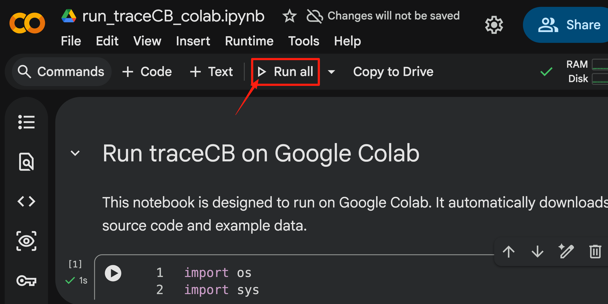

# Running the Tutorial

This tutorial provides a hands-on guide to applying `traceCB` using a sample dataset (provided as a "toy example") to analyze a single gene. We offer two methods to run this tutorial:

1.  **Google Colab (Recommended)**: A cloud-based environment requiring no installation.
2.  **Local Execution**: Running the tutorial on your own machine.

!!! note "Consistent Results"
    Both methods utilize the identical dataset and codebase in the background, ensuring consistent analytical results regardless of the execution environment. We recommend Google Colab for a quick start without setup overhead.

## Option 1: Quick Start with Google Colab

For immediate exploration without configuring a local environment, use our Google Colab notebook.

[https://colab.research.google.com/drive/1kfmlbzRdgyQ1BjkBe10x82tuKNGL5xqt?usp=sharing](https://colab.research.google.com/drive/1kfmlbzRdgyQ1BjkBe10x82tuKNGL5xqt?usp=sharing)

<figure markdown>
  { width="600" }
  <figcaption>Figure 1: Snapshot of the traceCB tutorial in Google Colab.</figcaption>
</figure>

## Option 2: Local Environment

For researchers preferring a local setup, the tutorial is available as a Jupyter Notebook.

1.  **Install traceCB**: Ensure you have installed the package and its dependencies (refer to the [Installation Guide](index.md#installation)).
2.  **Open the Notebook**: Navigate to the tutorial notebook at `docs/tutorial/run_traceCB.ipynb` and open it with Jupyter Notebook or VS Code (or any compatible IDE).
3.  **Run Locally**: Execute the file to reproduce the analysis.
