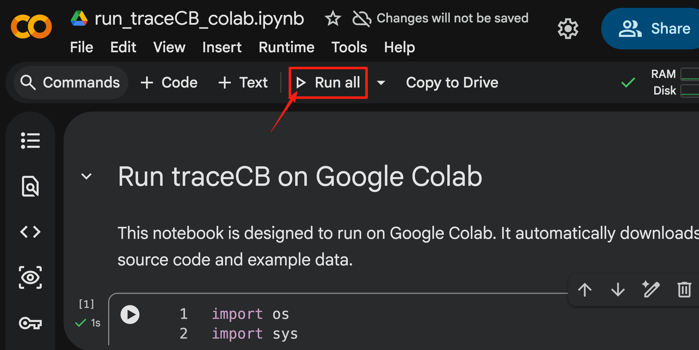

# Running the Tutorial

This tutorial provides a hands-on guide to applying `traceCB` using a sample dataset (provided as a "toy example") to analyze a single gene. We offer two methods to run this tutorial:

1.  **Google Colab (Recommended)**: A cloud-based environment requiring no installation.
2.  **Local Execution**: Running the tutorial on your own machine.

!!! note "Consistent Results"
    Both notebooks use the same public toy inputs. Colab downloads the current default branch; for manuscript reproduction, use a fixed source archive or Git commit and the Python environment in `environment.yml`. Numerical results can vary across dependency versions.

## Option 1: Quick Start with Google Colab

For immediate exploration without configuring a local environment, use our Google Colab notebook. Click the link below to open the tutorial directly in Colab, and use the **Run All** option to execute the entire notebook to see the results.

[](https://colab.research.google.com/github/lucajiang/traceCB/blob/master/docs/tutorial/run_traceCB_colab.ipynb)

<figure markdown>
  { width="600" }
  <figcaption>Figure 1: Snapshot of the traceCB tutorial in Google Colab.</figcaption>
</figure>

## Option 2: Local Environment

For researchers preferring a local setup, the tutorial is available as a Jupyter Notebook.

1.  **Install traceCB**: Run `pip install -e '.[tutorial]'` in the repository root (see the [Installation Guide](index.md#installation)).
2.  **Open the Notebook**: Navigate to the tutorial notebook at `docs/tutorial/run_traceCB.ipynb` and open it with Jupyter Notebook or VS Code (or any compatible IDE).
3.  **Run Locally**: Execute the file to reproduce the analysis.


Run all cells in order. The example aligns 2,072 variants for gene
`ENSG00000025708`, estimates the cross-population covariance, and compares
summary-statistic, traceC, and traceCB effects. Cell-type proportions in the
input CSV are percentages and are divided by 100 before modeling. If the
bulk-tissue covariance check fails, the tutorial uses the traceC estimates for
the tissue-enhanced output, matching the full-data runner.

Before execution, verify the example inputs from the repository root:

```bash
sha256sum --check data/toy_example/SHA256SUMS
```

The notebook outputs are deliberately cleared in Git. Executing the notebooks
creates tables and effective-sample-size summaries locally.
